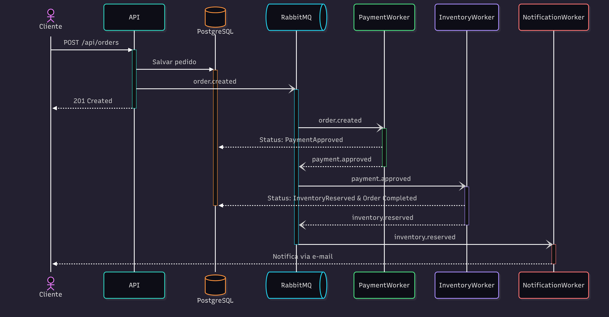

# E-commerce Order Processing
[](https://github.com/Pedro-Lucas-OKB/rabbitmq-ecommerce-order-processing/actions/workflows/ci.yml)

Sistema de processamento assíncrono de pedidos de e-commerce utilizando **MassTransit** com **RabbitMQ** e **.NET 8**.

## Sobre o Projeto

Este projeto implementa uma arquitetura de microsserviços para processamento de pedidos, onde diferentes partes do fluxo (pagamento, estoque, notificação) são processadas de forma **assíncrona** e **independente** através do MassTransit/RabbitMQ.

### Objetivos de Aprendizado

- **MassTransit 7.x** - Abstração sobre message brokers
- RabbitMQ (exchanges, queues, routing, acknowledgments)
- Processamento assíncrono com Workers e Consumers
- Entity Framework Core com PostgreSQL
- CI/CD com GitHub Actions

## Arquitetura (Diagrama de Sequência)


### Fluxo de Processamento

1. **Cliente** cria pedido via API
2. **API** salva no PostgreSQL e publica no RabbitMQ (`order.created`)
3. **PaymentWorker** consome, processa 
4. pagamento (70% aprovado, 30% rejeitado)
4. Se aprovado, publica na fila de estoque (`payment.approved`)
5. **InventoryWorker** consome e processa estoque (90% reservado, 10% sem estoque)
6. Se reservado, publica na fila de notificação (`inventory.reserved`)
7. **NotificationWorker** consome e simula envio de e-mail (2s de delay)
8. Status final: `Completed` ou `Failed`

## Stack Tecnológica

- **.NET 8** - Framework principal
- **ASP.NET Core Minimal APIs** - API REST
- **MassTransit 7.3.1** - Abstração sobre RabbitMQ (pub/sub simplificado)
- **Entity Framework Core** - ORM
- **PostgreSQL** - Banco de dados
- **RabbitMQ** - Message Broker
- **Docker & Docker Compose** - Containerização
- **FluentValidation** - Validação de requests
- **xUnit** - Framework de testes
- **Testcontainers** - Containers Docker para testes de integração
- **FluentAssertions** - Asserções expressivas nos testes

## MassTransit vs RabbitMQ.Client

Este projeto usa **MassTransit** como abstração sobre o RabbitMQ. Principais diferenças:

| Aspecto | RabbitMQ.Client (direto) | MassTransit |
|---------|--------------------------|-------------|
| **Setup** | Manual (exchanges, queues, bindings) | Automático via convenções |
| **Consumers** | Loop manual + `BasicConsume` | Interface `IConsumer<T>` |
| **Serialização** | Manual (JSON/bytes) | Automática |
| **Retry/Fault** | Implementação própria | Built-in policies |
| **DI** | Manual | Integrado com `IServiceCollection` |

### Mensagens

As mensagens são **enxutas** (apenas IDs). Os consumers buscam dados no banco:

```csharp
// Mensagem simples
public record OrderCreated { public Guid OrderId { get; init; } }

// Consumer busca dados completos
public class OrderCreatedConsumer : IConsumer<OrderCreated>
{
    public async Task Consume(ConsumeContext<OrderCreated> context)
    {
        var order = await _dbContext.Orders.FindAsync(context.Message.OrderId);
        // Processar...
    }
}
```

### Configuração MassTransit

```csharp
// Program.cs da API
builder.Services.AddMassTransit(config =>
{
    config.UsingRabbitMq((context, cfg) =>
    {
        cfg.Host("localhost", "/", h =>
        {
            h.Username("guest");
            h.Password("guest");
        });
    });
});
builder.Services.AddMassTransitHostedService(true);

// Program.cs do Worker
builder.Services.AddMassTransit(config =>
{
    config.AddConsumer<OrderCreatedConsumer>();
    config.UsingRabbitMq((context, cfg) =>
    {
        cfg.Host("localhost");
        cfg.ReceiveEndpoint("payment-queue", e =>
        {
            e.ConfigureConsumer<OrderCreatedConsumer>(context);
        });
    });
});
```

## Estrutura do Projeto

```
src/
├── OrderProcessing.Api/            # API REST (Minimal APIs)
├── OrderProcessing.Core/           # Dominio (Entities, DTOs, Enums, Validators, Messages)
├── OrderProcessing.Infrastructure/ # Persistencia (EF Core)
└── OrderProcessing.Workers/
    ├── PaymentWorker/              # Processa pagamentos (70% aprovacao)
    │   └── Consumers/              # OrderCreatedConsumer
    ├── InventoryWorker/            # Processa estoque (90% reserva)
    │   └── Consumers/              # PaymentApprovedConsumer
    └── NotificationWorker/         # Envia notificacoes por e-mail
        └── Consumers/              # InventoryReservedConsumer

tests/
├── OrderProcessing.UnitTests/          # Testes unitarios (validators, etc.)
└── OrderProcessing.IntegrationTests/   # Testes de integracao com Testcontainers
    └── Fixtures/                       # IntegrationTestFixture e ApiClient
```

## Executando o Projeto

### Pré-requisitos

- .NET 8 SDK
- Docker e Docker Compose

### 1. Subir a infraestrutura

```bash
docker compose up -d
```

Isso inicia:
- **PostgreSQL** (porta 5432)
- **RabbitMQ** (porta 5672, Management UI: 15672)
- **PgAdmin** (porta 5050)

### 2. Aplicar migrations

```bash
dotnet ef database update -p src/OrderProcessing.Infrastructure -s src/OrderProcessing.Api
```

### 3. Rodar a API e Workers

```bash
# Terminal 1 - API
dotnet run --project src/OrderProcessing.Api

# Terminal 2 - PaymentWorker
dotnet run --project src/OrderProcessing.Workers/PaymentWorker

# Terminal 3 - InventoryWorker
dotnet run --project src/OrderProcessing.Workers/InventoryWorker

# Terminal 4 - NotificationWorker
dotnet run --project src/OrderProcessing.Workers/NotificationWorker
```

### 4. Acessar

- **Swagger:** http://localhost:5057/swagger
- **RabbitMQ Management:** http://localhost:15672 (admin/admin123)
- **PgAdmin:** http://localhost:5050 (admin@ecommerce.com/admin123)

## Testes

O projeto inclui testes unitarios e de integracao.

### Executar todos os testes

```bash
dotnet test
```

### Testes Unitarios

Localizados em `tests/OrderProcessing.UnitTests/`. Testam componentes isolados como validators.

```bash
dotnet test tests/OrderProcessing.UnitTests
```

### Testes de Integracao

Localizados em `tests/OrderProcessing.IntegrationTests/`. Usam **Testcontainers** para subir containers Docker reais (PostgreSQL e RabbitMQ) durante os testes.

```bash
dotnet test tests/OrderProcessing.IntegrationTests
```

**Requisitos:** Docker deve estar rodando para os testes de integracao.

**Como funciona:**
1. O `IntegrationTestFixture` inicia container PostgreSQL via Testcontainers
2. Cria uma instancia da API em memoria via `WebApplicationFactory`
3. Substitui MassTransit/RabbitMQ por MassTransit InMemory
4. Aplica migrations do EF Core no banco de teste
5. Executa os testes usando um `HttpClient` pre-configurado
6. Limpa todos os recursos apos os testes

## Endpoints

| Método | Rota | Descrição |
|--------|------|-----------|
| `POST` | `/api/orders` | Criar pedido |
| `GET` | `/api/orders` | Listar pedidos |
| `GET` | `/api/orders/{id}` | Buscar pedido por ID |

## Status do Projeto

- [x] API REST com Minimal APIs
- [x] Integracao com PostgreSQL
- [x] Publisher RabbitMQ
- [x] PaymentWorker (Consumer)
- [x] InventoryWorker
- [x] NotificationWorker
- [x] Testes unitarios (validators)
- [x] Testes de integracao com Testcontainers
- [x] CI/CD com GitHub Actions

## Pipeline de Workers (MassTransit)

| Worker | Queue | Mensagem Consumida | Delay | Taxa Sucesso | Publica |
|--------|-------|-------------------|-------|--------------|---------|
| **PaymentWorker** | `payment-queue` | `OrderCreated` | 5s | 70% | `PaymentApproved` |
| **InventoryWorker** | `inventory-queue` | `PaymentApproved` | 3s | 90% | `InventoryReserved` |
| **NotificationWorker** | `notification-queue` | `InventoryReserved` | 2s | 100% | - |

### Fluxo de Mensagens

```
API ─► OrderCreated ─► PaymentWorker ─► PaymentApproved ─► InventoryWorker ─► InventoryReserved ─► NotificationWorker
```

## Licença

Este projeto é para fins de aprendizado.
